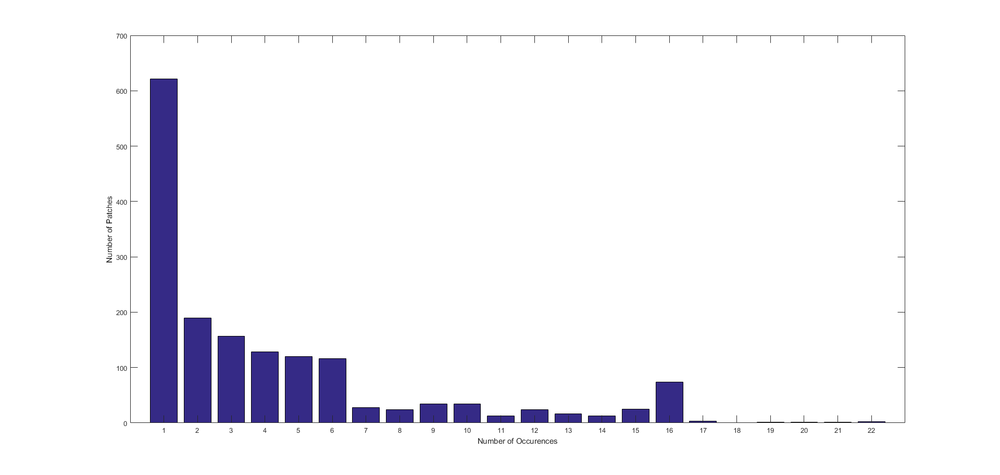
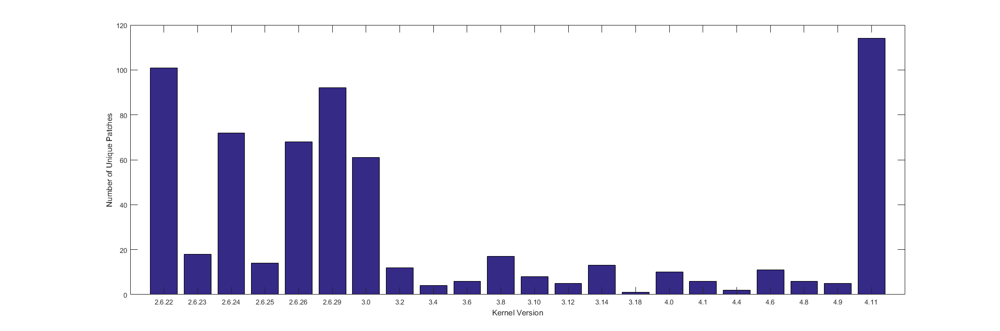
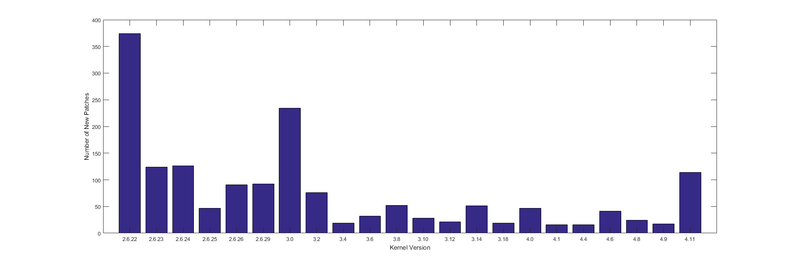
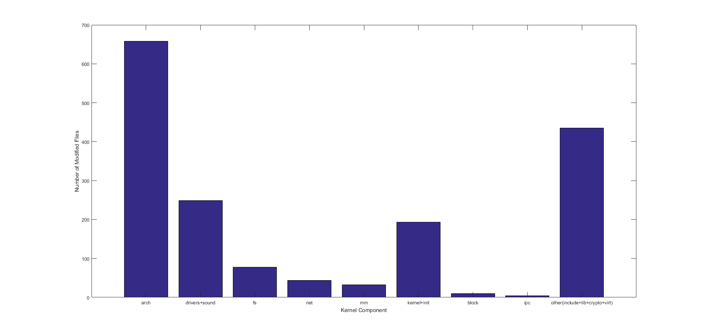

# patch重复度

patch出现频率的分布图如下



可以看出整张图像类似长尾分布，大部分patch出现的次数较少，只有少量patch出现多次。

出现了22次的两个patch均为RT相关的patch，在分析的各个内核版本中都有出现：

```
* [2.6.22 -   4.11] drivers/net: Use disable_irq_nosync() in 8139too {C::feature::rtsupport::replace with irq nosync}
* [2.6.22 -   4.11] ide: Do not disable interrupts for PREEMPT-RT {C::feature::rtsupport::nort irq}
```

出现17至21次的patch有：

```
* [2.6.24 -   4.11] core: Do not disable interrupts on RT in kernel/users.c {C::performance::irq::use the local_irq_*_nort variants to reduce latencies in RT}
* [2.6.29 -   4.11] hrtimer: Fixup hrtimer callback changes for preempt-rt {C::bug::hwerr::time::semantics::In preempt-rt we can not call the callbacks which take sleeping locks from the timer interrupt context.}
* [2.6.29 -   4.11] ata: Do not disable interrupts in ide code for preempt-rt {C::bug::hwerr::irq::irq:: Do not disable interrupts in ide code for preempt-rt}
* [2.6.29 -   4.11] posix-timers: Prevent broadcast signals {C::bug::data_err::semantics::semantics:: posix-timers-prevent-broadcast-signals}
* [2.6.23 -   4.11] infiniband: Mellanox IB driver patch use _nort() primitives {C::bug::crash::irq::irq::use _nort primitives}
* [2.6.23 -    4.8] relay: Fix timer madness {C::bug::deadlock::semantics::semantics::remove timer calls}
```

然而，这张分布图有一定的误导性。由于分析的patch对应的内核版本为从2.6~4.11，因此凡是4.11中引入的patch只可能出现一次（光是这样的patch就有上百个），同样，在4.9中引入的patch出现次数也不会超过两次，以此类推，我们可以认为patch重复次数的实际分布没有图中那么极端。

# 不同内核版本的patch独特度

不同内核版本中独有的RT patch的数量分布如下图：



对应某个内核版本的patch如果没有在其他版本出现过则被认为是独有的，由于在分析中2.6.22版本没有前驱，4.11版本没有后继，因而二者独有的patch数目最多。为了看的更加清楚，我们可以考虑新引入的patch，即在某一版本前都不存在，在该版本新引入的patch的分布。不同内核版本中新引入的RT patch的数量分布如下图：



从图中可以看出在3.2~4.9范围内每一次新引入的patch数量都不多，可以认为将Linux改进为实时操作系统的工作量较大，但功能完善后在各个版本间升级维护的代价相对较小。

# patch修改的文件在内核中的分布


